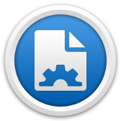

<div align="center">

<h1>Namagic</h1>
</div>

* [User guide](userguide/)
* [About the project](#about-the-project)
* [App structure](#app-structure)
* [Installation](#installation)
* [Development scripts](#development-scripts)
* [Changelog](changelog.md)
* [License](license.md)

## About the project

_A few lines about the project's story..._

[Namagic](https://www.namagicapp.com/) is a Mac application developed with web technologies.

It was one of the first web-based apps to be published on the Mac App Store, in April 2015. Its first version was actively developed between February and April 2015.

When I tried to publish the app on the Mac App Store for the first time, it was rejected, because the structure of NW.js did not respect the Store's guidelines.

So, with the useful help of [Alexey Stoletny](https://twitter.com/alexeyst), we [made it work](https://github.com/alexeyst/node-webkit-macappstore/pull/5), and we wrote a [Mac App Store submission guide](https://github.com/johansatge/nwjs-macappstore). That was a challenging part.

After a few more tries, the app got accepted eventually. That was great! :tada:

~50 copies were sold in the first weeks, and it was featured in a few Mac-related websites (_thanks to them! [link (in French)](http://www.macg.co/logiciels/2015/05/namagic-renomme-les-fichiers-avec-beaucoup-doptions-88798)_)

Then, after a few months, the app sunk in the Mac App Store's depths (probably because of my absence of skills in _selling stuff_, which is needed to maintain the app in the Trending section).

_That's why today (March 2017) I have decided to give that app a second life, by open-sourcing it on Github._

> Now the app is distributed under the [MIT license](license.md), the source code is available for free.
>
> However, if you want to support the project, the app can be bought [on the Mac App Store](https://itunes.apple.com/us/app/namagic/id985710846?l=fr&ls=1&mt=12).

## App structure

* The application is based on [NW.js](https://nwjs.io/)
* The UI is written with HTML&CSS, and the logic uses JavaScript, with a basic [MVC pattern](https://en.wikipedia.org/wiki/Model%E2%80%93view%E2%80%93controller)
* The build tasks use [Grunt](https://gruntjs.com/)

Here is the project structure:

```
app.nw
├── app.html                 // NW.js entrypoint
├── assets
│   ├── config.rb            // SASS config file
│   ├── css                  // Compiled CSS (app & libs)
│   ├── fonts                // Web fonts (icons)
│   ├── js
│   │   ├── libs             // JS libraries (jQuery)
│   │   ├── libs.min.js      // Minified libraries
│   │   ├── src
│   │   │   ├── app.js       // JS entrypoint
│   │   │   ├── controllers  // Controllers
│   │   │   ├── models       // Models (file renaming logic, app state...)
│   │   │   ├── utils        // Helpers (DOM, i18n...)
│   │   │   └── views        // JS views
│   │   └── src.min.js       // Minified app
│   └── sass                 // App styles
├── locale                   // i18n (JSON-based)
├── package.json
└── templates                // App templates
```

## Installation

> :bulb: This is a development installation.
>
> If you just want to get the built app, you can buy it [here, on the Mac App Store](https://itunes.apple.com/us/app/namagic/id985710846?l=fr&ls=1&mt=12).

Get the project:

```shell
$ git clone git@github.com:namagicapp/namagic.git
$ cd namagic
```

Install Grunt, if needed:

```shell
$ npm install grunt --global
```

Install the build dependencies:

```shell
$ npm install
```

Install the app dependencies:

```shell
$ cd app.nw
$ npm install
```

Download [NW.js](https://nwjs.io/) (tested on version `0.12.3`). The app should available here:

```
/Applications/nw.js
```

## Development scripts

The following Grunt tasks are available:

```shell
$ grunt run          # Run the app
$ grunt sass:watch   # Compile SASS files on update
$ grunt js:watch     # Compile JS files on update
$ grunt js:libs      # Compile JS libs, when adding or removing one
$ grunt html:compile # Compile HTML templates (no watcher for this one)
$ grunt build        # Build and sign the app (to be uploaded in iTunes Connect)
```
