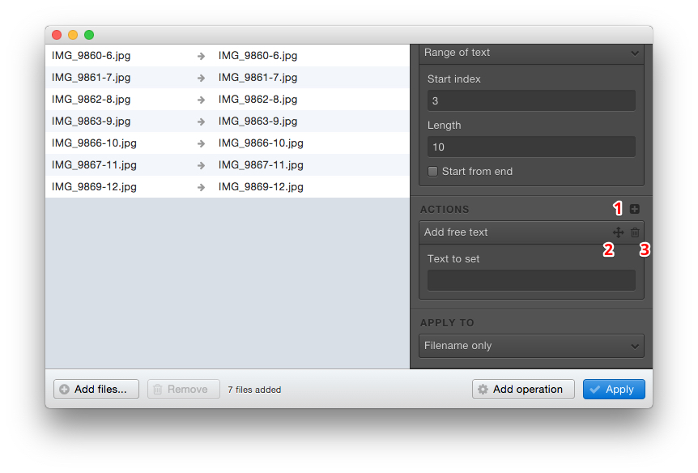
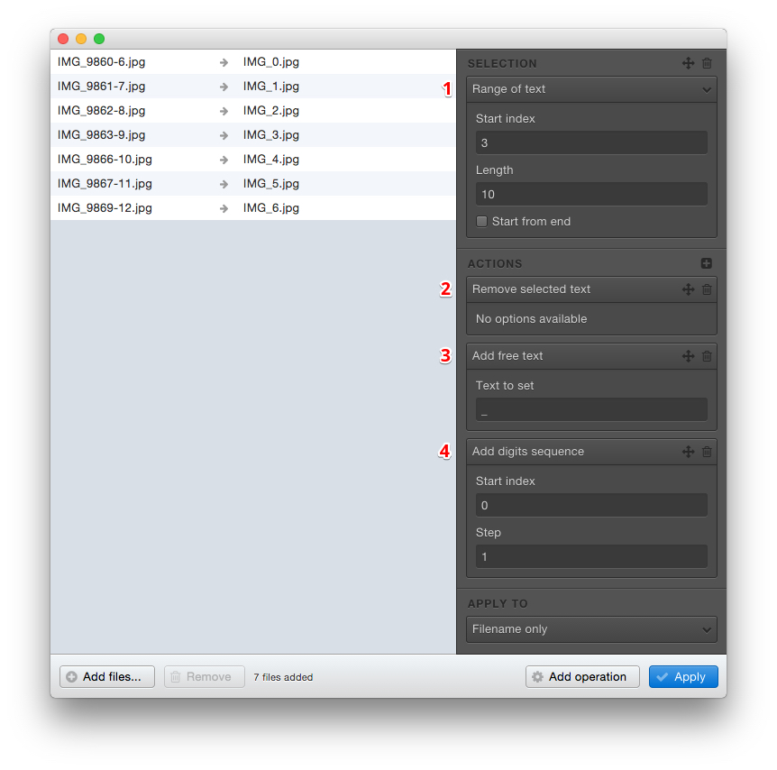

# Adding actions

Actions are used to modify the part of the filename that you have selected.

An action can update the selection, remove it, or append new text to it.

## Overview

1. Add an action by selecting its type
2. Move the action
3. Delete the action

## Working with multiple actions

Adding multiple actions in an operation allows you to build the filename you want by yourself, and make operations more flexible.

Let's consider the example below.

I would like to keep the `IMG_` part of my files, and append a clean number.

1. I select the part of the file I don't want anymore, by using the *Range of text* mode
2. I remove the concerned text
3. I add the `_` character
4. Finally I add my sequence of numbers
