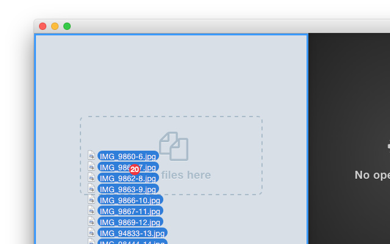

# Adding files

First things first, you probably want to add files to work with.

You can do so by drag&dropping them in the files list, or adding them by using the *Add* dialog.

Pleas note that you can work with folders too; so, dropping a folder on the list will add the folder itself, and not its contents.

