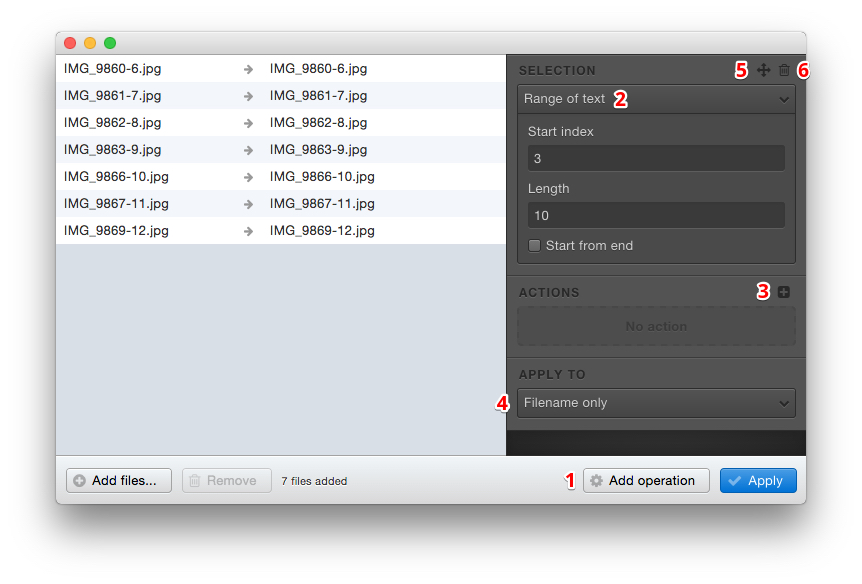
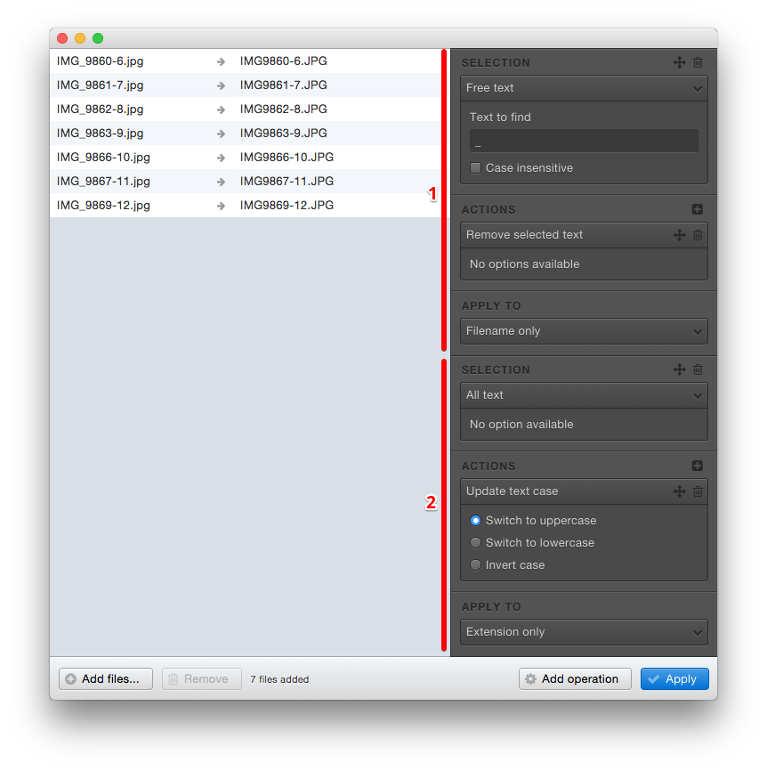

# Adding operations

Operations are the core of the application.

An operation allows you to select the part of the filename you want to edit, and apply one or more action(s) on it.

## Overview

Operations are located on the right of the window.

1. Add an operation
2. Choose the selection mode
3. Add one or more action(s)
4. Select the target (filename, extension, or both)
5. Move your operation
6. Delete the operation

## Working with several operations

You can add several operations if you want to work independently on different parts of your filenames.

In the screen below, we have used two operations.

* The **first** one is used to remove a part of the filename
* The **second** one updates the case of the extension

