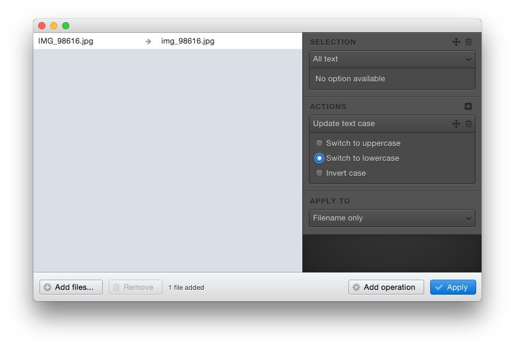

# Available actions

This page lists the available actions.

## Remove selected text

Removes the selected part of the file.

If you have selected a position, this action will do nothing.

## Add free text

Adds your own text to the selection.

## Add digits sequence

Adds a number.

With the default settings, it starts with `0` and is incremented one by one.

If needed, you can specify your own starting number and step:

## Update text case

Modifies the case of the selection.

## Add creation date

Writes the date of creation of each file, in the desired format.

Available date parts are listed in the *Format* field.

Please note that the *Format* field is free, you can type the text you want in addition to the special chars such as `YYYY` or `MM`.

## Add modification date

Writes the date on which the file was modified, in the desired format.

## Add file size

Gets the size of each file, in the appropriate format (`Kb`, `Mb`, `Gb`...)

