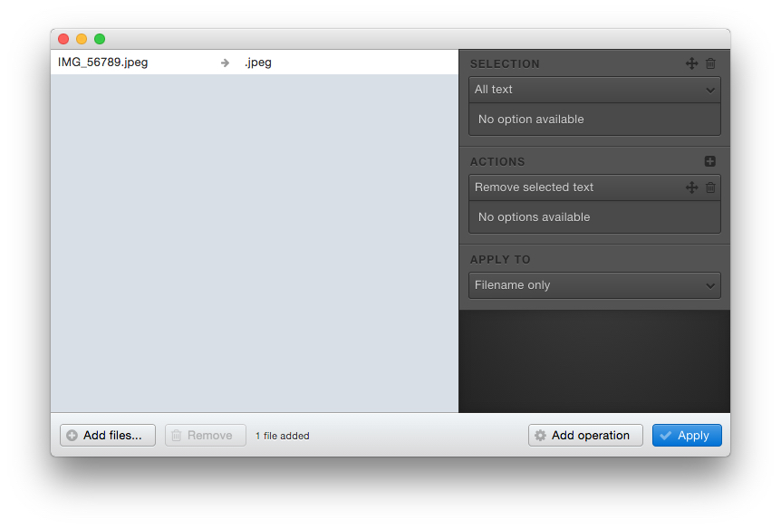
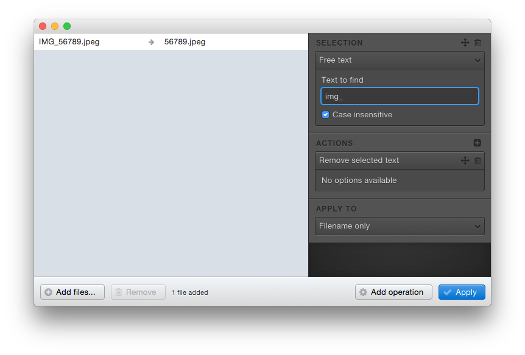
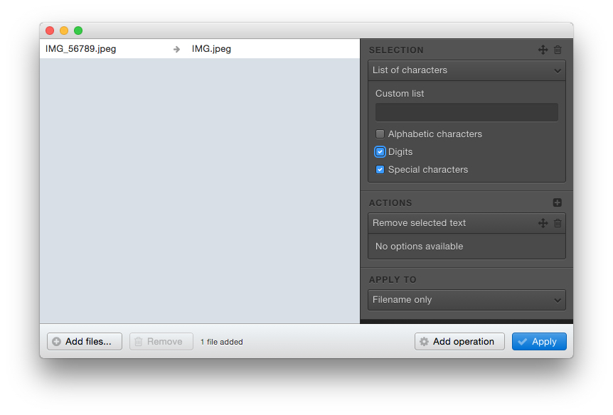
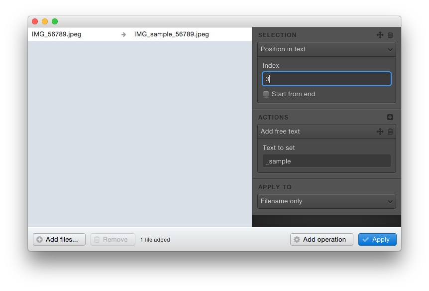
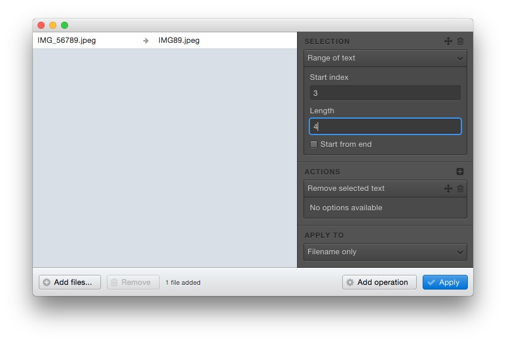
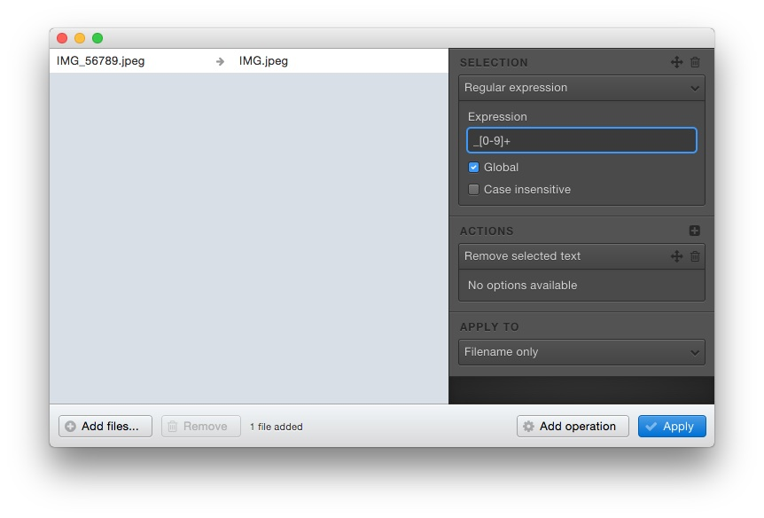

# Available selection modes

This page lists the selection modes that you can use.

## All text

Selects the whole filename.

If you work with the extension, it will include the point (in the above screen, it will select `.jpeg` and not `jpeg`).

## Free text

Type the text you want to select.

Check *Case insensitive* if needed (the case is the difference between uppercase and lowercase).

## List of characters

Searches for specific characters.

The tool provides predefined patterns:

* Special characters (Everything but numbers and letters)
* Numbers
* Alphabetical characters

You can define your own list, too:

## Position in text

Selects a position in the filename.

The first character is at index *0*.

You can also choose to start by the end; if you do so, the *0* index will be the position before the `.` of the file extension.

## Range of text

Selects a part of the filemane.

The index works the same way than the *position* tool; the *length* is the number of characters you want to select.

## Regular expression

If you are an advanced user, you can write your own, Javascript_flavored, [regular expression](http://www.regular-expressions.info/javascript.html).

The *Global* checkbox enables global matching (`g`); the *Case insensitive* one enables case_insensitive matching (`i`).

If there is an error in your expression, the operation will be skipped.

Finally, don't forget to escape your special characters by using the `\` character.
