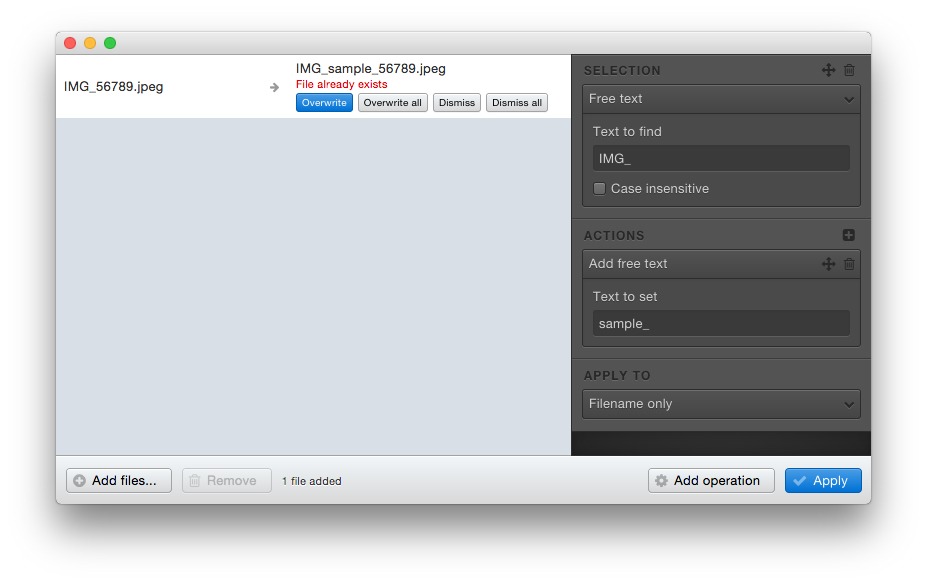

# Updating the files

Click on the *Apply* button to save your renamed files.

Before applying the new names, the application will ask you to select the destination folder.

## Renaming the files

By default, the selected destination folder is the one of which the last added file comes from.

If you keep this folder, the files will be renamed.

## Copying the files

If you select an other folder, renamed files will be copied in it.

If files with the same name already exist,
a warning message will appear and you will have to choose if you want to skip or overwrite each file.

